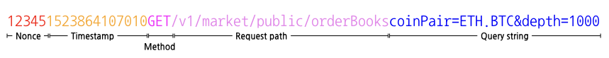

# 인증 및 보안 정책

BITFRONT API는 사용자 보호를 위해 인증 및 보안 정책을 적용합니다. API를 사용하는 모든 사용자는 아래 정책을 따라야 합니다.

## API KEY와 API SECRET

거래 및 계정 귀속 정보를 확인하는 BITFRONT API를 사용하려면 반드시 API KEY와 API SECRET이 있어야 합니다.

  - `/v*/public`, `/v*/market/public`으로 시작하는 단순 조회용 API는 예외입니다.
  - API KEY와 API SECRET 발급 신청을 하려면 [BITFRONT](http://bitfront.me) 회원으로 가입해야 합니다. 상세한 내용은 [사전 준비](/ko/1_Overview.md#사전-준비)를 확인하십시오.
  - API KEY와 API SECRET은 대소문자를 구분합니다.

> **주의**
> 
> 인증 정보는 개인이 안전한 곳에 보관해야 합니다. 민감한 정보를 보호하기 위해 이 정보를 두 번 다시 출력하지 않으므로 API SECRET을 잃어버리면 기존 API KEY를 삭제하고 새로 발급해야 합니다.

## 타임스탬프 검증

API 서버는 API 요청이 왔을 때 그 타임스탬프와 서버의 타임스탬프를 비교하여 해당 요청이 시간적으로 적합한 요청인지 확인합니다. 시간적으로 안전하지 않은 요청은 거절합니다.

시간상 부적합으로 판단하는 조건은 다음과 같습니다.

  - API 요청의 타임스탬프가 서버의 타임스탬프보다 1초 이상 빠르면 요청을 거절합니다.
  - API 요청 헤더의 타임스탬프와 서버의 타임스탬프를 비교하여 정해진 시간 간격을 초과하면 요청을 거절합니다. 정해진 시간 간격은 API에 따라 다릅니다.
      - 주문 취소 요청은 시간 간격이 10초를 초과하면 요청 거절
      - 그 외의 요청은 시간 간격이 5초를 초과하면 요청 거절

## RPS 제한 정책

하나의 API KEY를 사용한 API 요청은 다음처럼 횟수를 제한합니다.

  - 모든 요청에 대해 하나의 API KEY는 1초당 3회, 1분당 30회만 허용합니다. (별도 합의한 경우 제외)
      - 예외) `/v2/account/tradeHistory` API는 1초당 1회, 1분당 30회만 허용합니다.
  - 주문 또는 주문 취소 요청일 경우, 각 요청 간 시간 간격은 최소 10ms를 권장합니다. 이보다 짧으면 요청을 처리하는데 실패할 수 있습니다.
  - 제한 RPS를 초과하는 요청은 거절합니다.

## 서명 정책

API KEY가 필요한 API 요청에는 반드시 서명이 있어야 합니다.

  - 사전에 발급받은 API SECRET을 이용해 논스값(nonce), 타임스탬프, 메서드, 요청 경로(request path), 쿼리 문자열(query string), 요청 본문(request body)을 차례대로 붙여서 만든 문자열로 HMAC-SHA256 서명을 만듭니다.

  - 논스값은 헤더 파라미터의 `X-API-NONCE`와 같은 값으로, 5자리 임의의 양수 정수이며 같은 타임스탬프 범위 내에서 사용하지 않은 값이어야 합니다.

  - **타임스탬프는 헤더 파라미터의 `X-API-TIMESTAMP`와 같은 값이며, UTC Unix Epoch 형식입니다.**

  - 메서드는 API 요청의 HTTP 메서드이며, 대문자여야 합니다.

  - 요청 경로는 요청 URI의 path 부분을 의미합니다.
    
    예를 들어, 요청 URI가 `https://openapi.bitfront.me/v1/trade/openOrders?market=ETH&currency=BTC&max=100`이면, 요청 경로는 `/v1/trade/openOrders`입니다.

  - 쿼리 문자열은 요청 URI의 쿼리 파라미터를 의미합니다.
    
    예를 들어, 요청 URI가 `https://openapi.bitfront.me/v1/trade/openOrders?market=ETH&currency=BTC&max=100`이면, 쿼리 문자열은 `market=ETH&currency=BTC&max=100`입니다.
    요청 경로와 구분하는 물음표(‘?’)는 포함하지 않으니 주의하십시오.
    
    POST 요청일 때는 생략 가능합니다.

  - 요청 본문은 HTTP 요청 본문에 포함된 문자열로, 쿼리 문자열과 같이 각 파라미터의 키와 값을 ‘&’과’=’로 연결한 형식입니다.
    
    GET 요청일 때는 생략 가능합니다.

### 생성 예제

아래 예제는 서명을 생성하고, 이를 이용해 요청을 보내는 방법을 보여줍니다.

예제에서 사용할 기본 데이터는 다음과 같습니다.

| 항목         | 값                                |
| ---------- | -------------------------------- |
| API KEY    | 6W206egN32nCQ0VB                 |
| API SECRET | dwjnGqCVzfHlW6Q9r4BjXpmiK1WCdMBI |
| 타임스탬프      | 1523864107010                    |
| 논스값        | 12345                            |

**예제 1: 쿼리 문자열 방식**

첫 번째 예제는 쿼리 문자열 방식으로 파라미터를 전달합니다.
예제의 API 요청 정보는 다음과 같다고 가정합니다.

| 항목       | 값                                          |
| -------- | ------------------------------------------ |
| HTTP 메서드 | GET                                        |
| 요청 경로    | `/v1/trade/openOrders`                     |
| 파라미터     | `market`: ETH, `currenty`: BTC, `max`: 100 |

서명에 필요한 문자열은 다음처럼 만들 수 있습니다.



LINUX에서 `echo`와 `openssl`을 사용해 HMAC SHA256 서명을 생성합니다.

``` bash
echo -n "123451523864107010GET/v1/trade/openOrdersmarket=ETH&currency=BTC&max=100" \
  | openssl dgst -sha256 -hmac "dwjnGqCVzfHlW6Q9r4BjXpmiK1WCdMBI"
  (stdin)= 4e211ada0a332cb8611560c2109eed51618ea4aed3976eb973e9edae12d433e4
```

`curl`을 이용해 생성한 서명을 API 요청 헤더에 전달합니다.

``` bash
curl --header "X-API-KEY: 6W206egN32nCQ0VB" \
     --header "X-API-SIGN: 4e211ada0a332cb8611560c2109eed51618ea4aed3976eb973e9edae12d433e4" \
     --header "X-API-TIMESTAMP: 1523864107010" \
     --header "X-API-NONCE: 12345" \
     --header 'content-type: application/x-www-form-urlencoded' \
     -X GET '/v1/trade/openOrders?market=ETH&currency=BTC&max=100' \
```

**예제 2: 요청 본문 방식**

두 번째 예제는 요청 본문 방식으로 파라미터를 전달합니다.
예제의 API 요청 정보는 다음과 같다고 가정합니다.

| 항목       | 값                                                    |
| -------- | ---------------------------------------------------- |
| HTTP 메서드 | POST                                                 |
| 요청 경로    | `/v1/trade/marketOrders`                             |
| 파라미터     | `quantity`: 1, `coinPair`: ETH.BTC, `orderSide`: BUY |

서명에 필요한 문자열은 다음처럼 만들 수 있습니다.


LINUX에서 `echo`와 `openssl`을 사용해 HMAC SHA256 서명을 생성합니다.

``` bash
$ echo -n "123451523864107010POST/v1/trade/marketOrdersquantity=1&coinPair=BCH.ETH&orderSide=BUY" \
 | openssl dgst -sha256 -hmac "dwjnGqCVzfHlW6Q9r4BjXpmiK1WCdMBI"
  (stdin)=03838b25c336e0a6fb3617b9b07c9da9d91d96ab0e61598aa7e6cd1396b2b3ef
```

`curl`을 이용해 생성한 서명을 API 요청 헤더에 전달합니다.

``` bash
curl --header "X-API-KEY: 6W206egN32nCQ0VB" \
     --header "X-API-SIGN: 03838b25c336e0a6fb3617b9b07c9da9d91d96ab0e61598aa7e6cd1396b2b3ef" \
     --header "X-API-TIMESTAMP: 1523864107010" \
     --header "X-API-NONCE: 12345" \
     --header 'content-type: application/x-www-form-urlencoded' \
     -X POST 'https://openapi.bitfront.me/v1/trade/marketOrders' \
     --data 'quantity=1&coinPair=BCH.ETH&orderSide=BUY'
```
